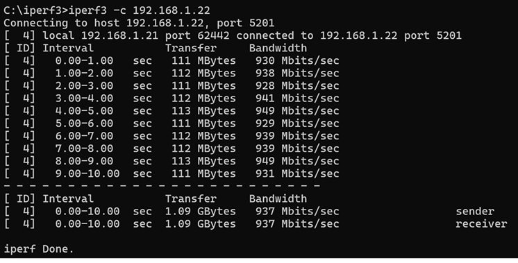
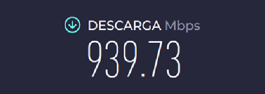
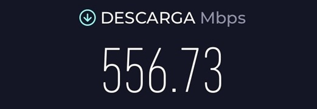
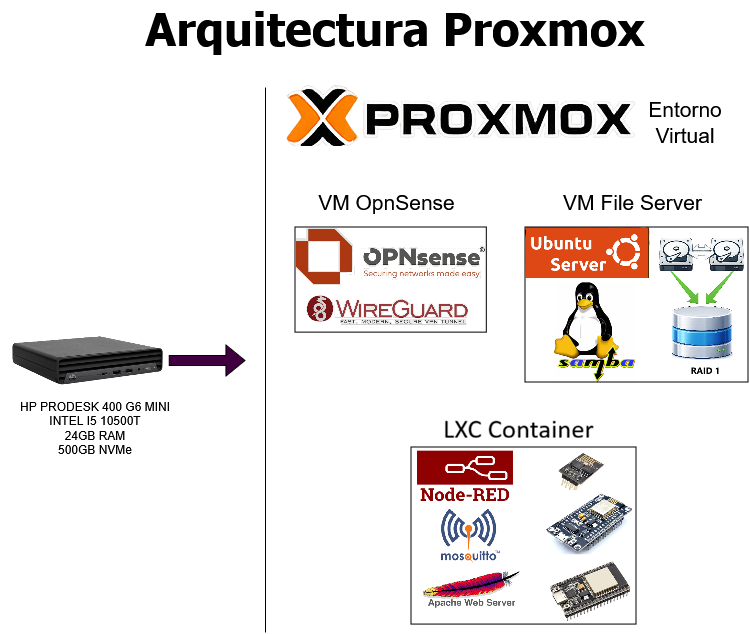
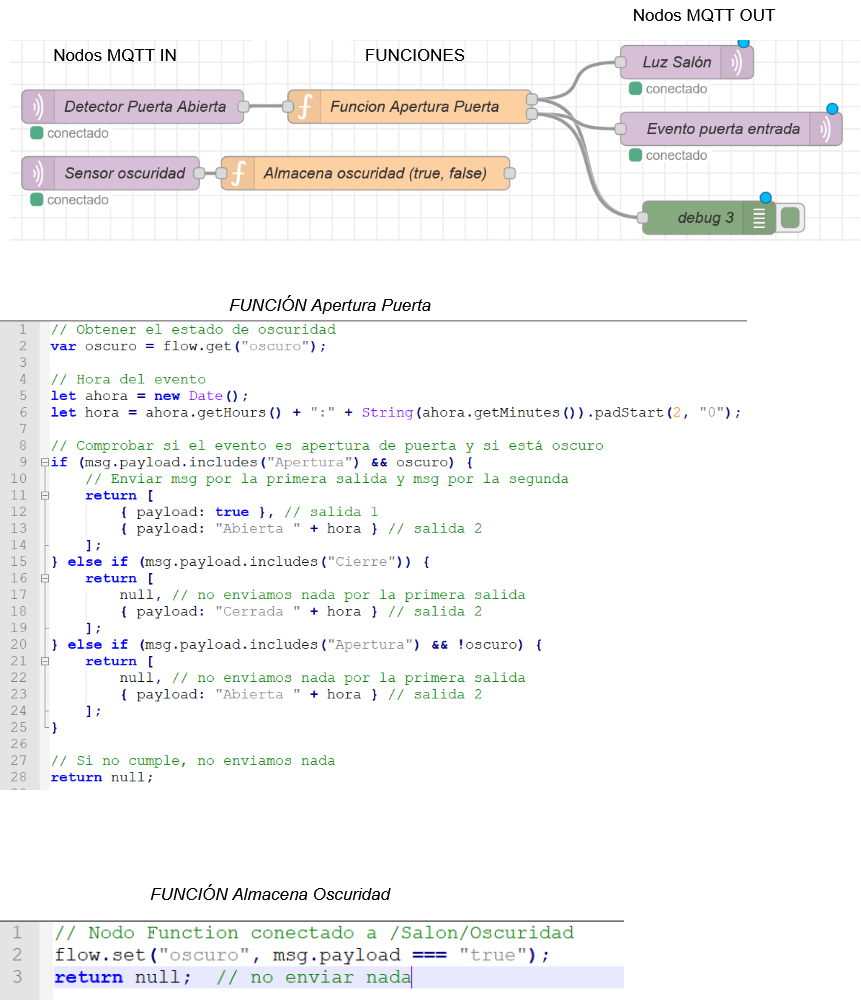

# 🏠 Infraestructura de Homelab

Infraestructura doméstica personal centrada en redes, virtualización y servicios autoalojados.

## 🧠 Resumen

Este proyecto representa mi infraestructura doméstica, diseñada para simular un entorno empresarial pequeño.  

Objetivos principales:
- Segmentación y seguridad de red
- Virtualización de servicios
- Automatización y escalabilidad
- Experimentación con sistemas domóticos

---

## 🖥️ Hardware

- HP ProDesk 400 G6 Mini
  - Intel i5-10500T
    - 6 núcleos
    - 12 subprocesos
    - Hyper-Threading
  - 24 GB RAM
  - WD Blue SN580 500 GB NVMe

---

## 🌐 Arquitectura de Red

- Router del ISP en modo bridge
- Host Proxmox
- VM OPNsense (firewall y routing)
- Switch gestionable (TP-Link SG608E)
- Red cableada a 1Gbps (UTP Cat.6)
- Punto de acceso WiFi (Huawei AX3)

**Diagrama de red:**  

---

## 🌐 Rendimiento
- Iperf en LAN
  

- Test de velocidad con SpeedTest Ethernet
  

- Test de velocidad con SpeedTest WiFi
  

---

## 🔐 Redes

- Reglas de firewall con OPNsense
- Acceso VPN mediante WireGuard

---

## 🧩 Virtualización de máquinas virtuales (Proxmox)

- OPNsense (Firewall y VPN)
- Ubuntu Server (Samba NAS en RAID1)
- Ubuntu Server (Jarvis AI – en desarrollo)

### ☁️ Servicio de nube privada

Para el almacenamiento de datos se ha implementado un sistema de nube privada basado en almacenamiento redundante.

- Se utilizan **2 discos duros mecánicos de 2TB** conectados por USB 3.0.
- Configuración en **RAID1 (espejo)** para garantizar la integridad de los datos ante fallo de uno de los discos.
- El sistema está gestionado mediante un servidor Linux, permitiendo compartir archivos en red local.

#### 🧩 Características

- Redundancia de datos (tolerancia a fallo de un disco)
- Acceso desde la red local
- Base para servicios adicionales (backups, almacenamiento centralizado, etc.)

#### ⚠️ Consideraciones

- El uso de discos USB introduce ciertas limitaciones frente a soluciones SATA (latencia y fiabilidad del bus).
- RAID1 no sustituye a una estrategia de backup externo.

### Contenedor (LXC)

- Stack de automatización doméstica:
  - Broker MQTT
  - Node-RED
  - Dashboard web
  - Web Server (Apache)

**Arquitectura Proxmox:**  

---

## 🏠 Automatización Domótica

- Comunicación basada en MQTT
- Dispositivos ESP8266, ESP32 y NodeMCU
- Flujos Node-RED para automatización

**Ejemplo de flujo Node-RED:**  
- Este es un ejemplo de un flujo que gestiona el encendido de la Luz del salón. Disponemos de una LDR (resistencia variable con la luminosidad) conectada a una pata de un ESP32. En relación con la cantidad de luz recibida (ya sea de lámparas o bien luz diurna), nos envíará un true o un false que publicaremos por MQTT, indicándonos si hay oscuridad (true) o luz (false).
- Por otro lado tengo un sensor MPU6050 (sensor giroscópico) instalado y fijado a la puerta de entrada de la vivienda. Este sensor al moverse la puerta en una dirección o en otra (apertura o cierre), genera dos eventos, uno para cada movimiento el cual también publicamos por MQTT.
- Como disponemos de sensor de oscuridad por un lado y detección de apertura de puerta a la vivienda por otro, podemos mediante Node-Red y MQTT, gestionar un encendido automático de las luces al detectar una apertura y así obtener una especie de bienvenida.
  

